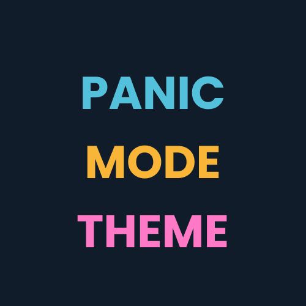
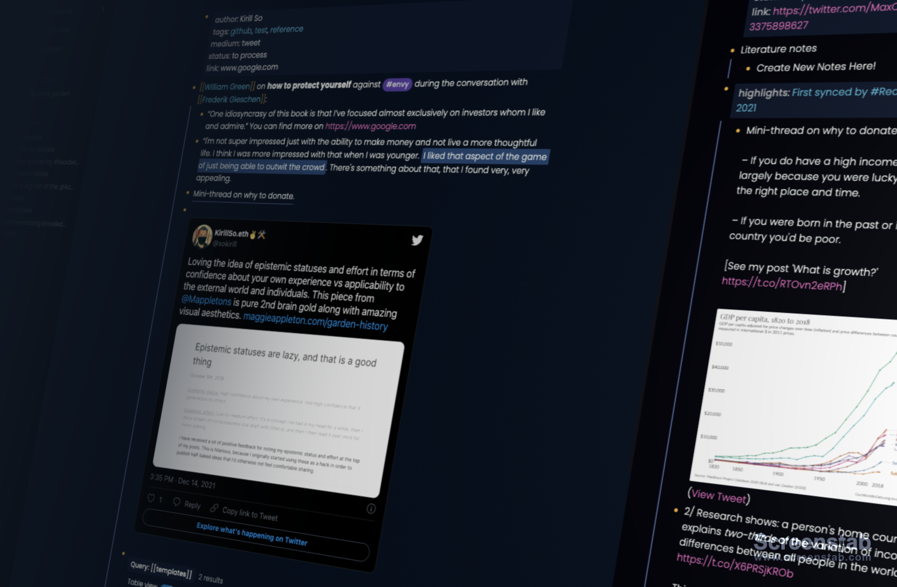
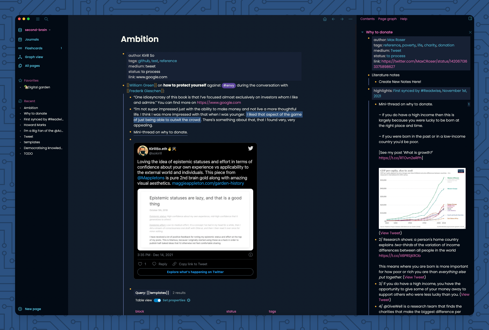

# Panic theme for Logseq

The [Logseq](https://logseq.com/) Panic theme is a dark-only theme inspired by [Bear](https://bear.app)'s Panic mode theme and [Panic](https://panic.com/)'s Palette theme with neutral colors.


## Changes

- Font has been changed to Poppins (originally Avenir)
- Using bright pink to differentiate internal and external links (feel free to change it in the `custom.css` to your liking)

## Screenshots




## Usage

You can just add the following lines to `custom.css`

```css
/* This must be the first line of the custom.css with other import rules */
@import url('https://sokirill.github.io/logseq-panic-theme/custom.css');
```

Or, just download / copy the code and paste it into your logseq CSS configuration file

## Issues

This is an early iteration of the theme and there probably are several issues whilst running it. If you face any bugs or problems kindly:

- Open an issue ticket [here](https://github.com/sokirill/logseq-panic-theme/issues/new). Don't forget to include a description and screenshot/video.
- Optionally, you can ping me on [Twitter](https://twitter.com/sokirill)

## Legal speech

By no means I claim to have originally produced this theme and in case a legal dispute arises I am voiding all rights and responsiblity from

## Bullet threading

If you don't want bullet threading in the theme, just delete all the code from `custom.css` the the following mention:

```css
/* Bullet threading*/
```

## Credits

Original theme by [Zeno Rocha](https://github.com/zenorocha/dracula-theme)

Original theme for logseq by [Michael Kaminsky](http://github.com/mkaminsky11)

Threading bullets by [Peng Xiao](https://github.com/Pengx17)

## Support my work

<a href="https://www.buymeacoffee.com/kirill" target="_blank"></a>
